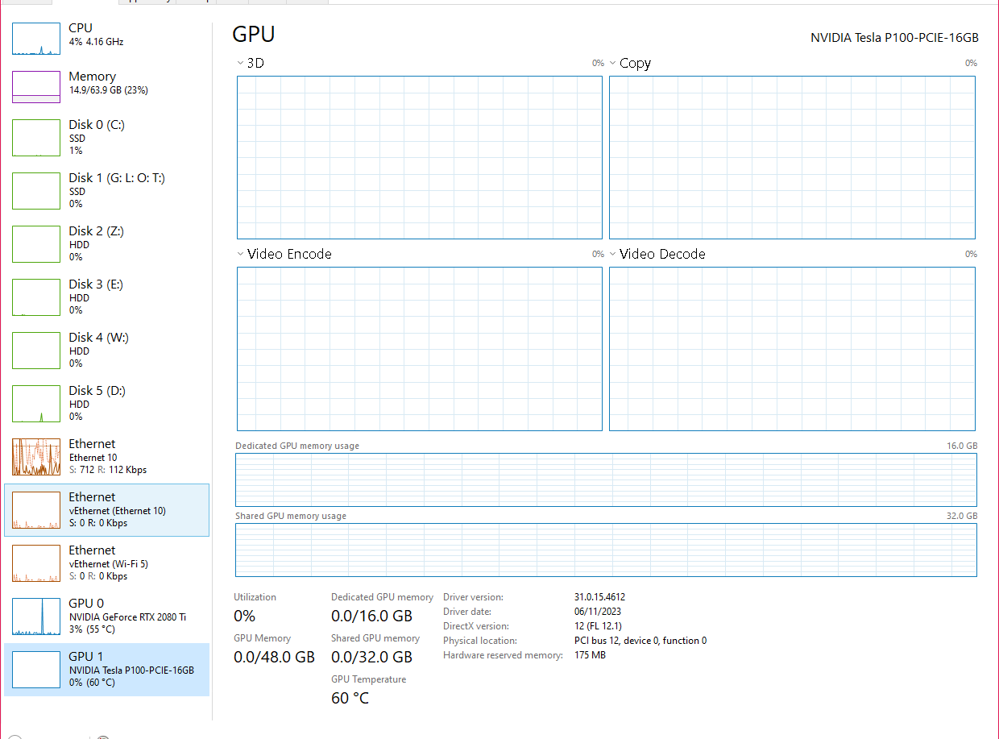

# Tesla P100 16Gb Error code 43/WDDM Mode not available solution:  
## The story:
If you use Tesla P100 with iGPU/AMD Gpu then just install the newest grid driver from [This Google Cloud link](https://docs.cloud.google.com/compute/docs/gpus/grid-drivers-table#windows_drivers), no need to read anymore.  
If you use Tesla P100 with Quadro card, install the Quadro RTX driver.  
Personally, I use the Tesla P100 with my RTX 2080 Ti and I couldn't enable WDDM on the P100 if I install the Game Ready/Studio 2080Ti driver, but installing any above drivers can enable WDDM mode but not recognizing my 2080Ti.  
## The solution:
The CUDA Toolkit bundled driver support both 2080Ti and P100 with WDDM mode. Thanks to Garrod Zhang (@garrod_zhang) for reporting it, I take no credit in this, he's the real ni🅱️🅱️a: [Come and say Thanks to his post](https://egpu.io/forums/builds/2022-15-6-asus-tuf-gaming-f15-3050-12th4p8eh-tesla-p100-32gbps-tb3-razer-core-x-chroma-win11-23h2/)  
Download the CUDA Toolkit from [This link](https://developer.nvidia.com/cuda-toolkit-archive), note that the last version that comes bundled with driver (as of writing now) is 12.9.1, the 13.x version does not come with driver at all.  
I downloaded the Cuda 12.3.2 simply because Pytorch is compatible with it, so ymmv.  
During the installation, just uncheck the CUDA Parts and any other parts you don't need, just the driver is enough for me.  

# Registry Hax:

After installing the driver, you may notice that the Tesla P100 graphics card is not detected in the Task Manager. Therefore, you need to modify the registry.

Please press ```WIN + R``` to open the Run window, then enter ```regedit``` to get into register table, and then enter ```Computer\HKEY_LOCAL_MACHINE\SYSTEM\ControlSet001\Control\Class\{4d36e968-e325-11ce-bfc1-08002be10318}\``` in path to modify its content, check for each ```{001}, {002},...``` folder to find the actual one corresponding to your P100.
* Modify AdapterType to 1
* Modify FeatureScore to d1

Add Dword:

* Fill in 1 for EnableMsHybrid
* Fill in 7 for GridLicensedFeatures


After modifying the registry, restart and the P100 is detected inside my task manager.  



## How to use the P100 graphics card?
Plenty of guide available already, read it from them.
